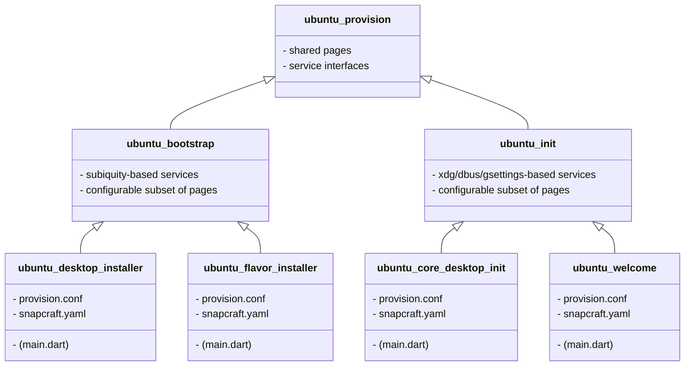

# Ubuntu Desktop Provision

## Contributing

See our [contributor guidelines](CONTRIBUTING.md).

## License

The Ubuntu Desktop Provision is licensed under the [GNU General Public License version 3](LICENSE).
